<!-- .slide: class="align-center" -->

<!-- .slide: data-state="no-toc-progress" --> <!-- don't show toc progress bar on this slide -->

# Organizing Entrepreneurial Teams
<!-- .element: class="no-toc-progress" --> <!-- slide not in toc progress bar -->

## A Natural Field Experiment of the Autonomy in Choosing Teams and Ideas

  

[Christoph Ihl][1] (joint with Tia Boss & Linus Dahlander)

  

2020-01-20 | [MST-Research Seminar Series][2] | TU Hamburg

 <!-- .element: class="logo" -->

[1]: https://www.startupengineer.io/authors/ihl/
[2]: https://www.tuhh.de/alt/sdw

----  ----

<!-- .slide: class="align-center" -->

# Motivation

----

<!-- .slide: class="align-top" -->

## Corporate Innovation & Entrepreneurship

* Companies try to spur innovation and entrepreneurship throughout their organizations 
  
  (Burgelman, 1983; Kanter, 1985)<!-- .element: class="reference" -->   

* Methods such as: 

 

  * Tiger Teams  

    (Wheelwright & Clark, 1992)<!-- .element: class="reference" --> 

  * Skunk works, Bootlegging  

    (Criscuolo et al., 2014)<!-- .element: class="reference" --> 

  * *X% Projects* in companies like 3M, google, Valve, Oticon, github

    (Biancani et al., 2014; Lovas & Ghoshal 2000; Puranam & Häakonsson. 2015)<!-- .element: class="reference" --> 

  * Agile Development 

    (e.g. at Spotify in "tribes" and "squads")<!-- .element: class="small" --> 

----

<!-- .slide: class="align-top" -->

## The Role of Autonomy

> "If You Love Your Employees, Set Them Free: Autonomy Is Key To Employee Engagement."
>
> -- <cite>Stan Phelps, Forbes, 2019</cite>

 

#### Advantages

* Creativity  

  (Amabile & Gitomer, 1984)<!-- .element: class="reference" --> 

* Ideation  

  (Miner, 1994)<!-- .element: class="reference" --> 

* Invention  

  (Gambardella et al., 2020)<!-- .element: class="reference" --> 

* Entrepreneurship 

  (Lumpkin et al., 2009)<!-- .element: class="reference" --> 

#### Disadvantages

* Opportunistic behavior and agency risks 

  (Shimizu, 2012)<!-- .element: class="reference" --> 

* Coordination problems & lack of focus

  (Van de Ven, 1986)<!-- .element: class="reference" --> 

* Find the right balance with control  

  (Simon et al., 1999)<!-- .element: class="reference" --> 

* Benefits unfold only in right context

  (Criscuolo et al., 2014; Gambardella et al., 2020)<!-- .element: class="reference" --> 

----

<!-- .slide: class="align-top" -->

## Disentangling Autonomy

* Autonomy has different dimensions:

  * Strategic vs. operational autonomy: what to do vs. how to do it

    (Bailyn, 1985)<!-- .element: class="reference" --> 

  * Firm level: HR practices such as delegation of decision making

    (Lumpkin et al., 2009, Foss et al., 2011)<!-- .element: class="reference" --> 

  * Inidvidual level: selection of tasks vs. time allocation

    (Gambardella et al., 2020)<!-- .element: class="reference" -->
 
* <!-- .element: class="fragment" -->This paper:

  * (Entrepreneurial) Team level

    (Bailyn, 1985)<!-- .element: class="reference" --> 

  * Organizational design perspective: task division v. task allocation

    (e.g. Galbraith, 1967)<!-- .element: class="reference" --> 

  * Managerial assignment vs. Autonomous self-selection or choice

    (Puranam et al., 2014)<!-- .element: class="reference" --> 

----

<!-- .slide: class="align-top" -->

## Practical Relevance

* Different organizational designs of entrepreneurship can be observed:

 
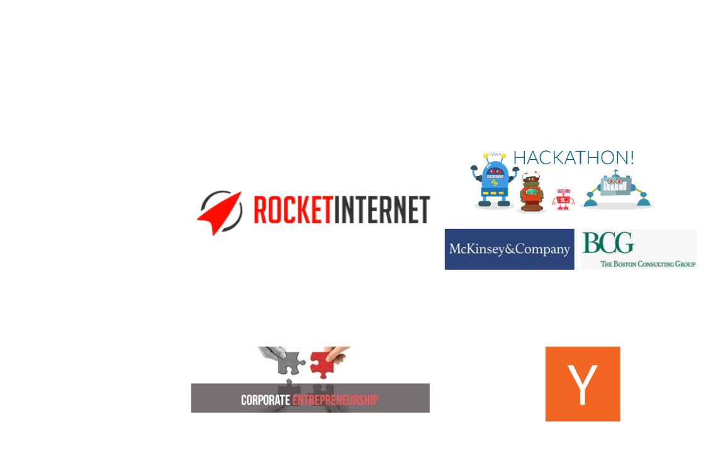

----  ----

<!-- .slide: class="align-center" -->

# Theory

----

<!-- .slide: class="align-top" -->

## Autonomy in Choosing Teams

 

#### Advantages

* Choice based on prior ties leads to cohesion  

  (Reagans et al., 2004)<!-- .element: class="reference" --> 

* Familarity improves coordination 

  (Huckman et al., 2009; Cattani et al. 2013)<!-- .element: class="reference" --> 

* Choice based on complementary skills  

  (McPherson et al., 2001)<!-- .element: class="reference" --> 

* Sorting based on ambition 

  (Brannon et al., 2013)<!-- .element: class="reference" --> 

#### Disadvantages

* Relational interia

  (Gulati & Gargiulo, 1999, Seabright et al., 1992)<!-- .element: class="reference" --> 

* Stay inside social comfort zone

  (Ingram & Morris, 2007)<!-- .element: class="reference" --> 

* Suffer from "competency discount"

  (Ruef et al., 2003)<!-- .element: class="reference" -->

 

> Hypothesis 1:
> Autonomy in choice of team members leads to higher entrepreneurial team performance.

----

<!-- .slide: class="align-top" -->

## Autonomy in Choosing Ideas

 

#### Advantages

* Source of intrinsic motivation; procedural utility

  (Lovas & Ghoshal 2000; Sauermann & Cohen, 2010, Benz & Frey, 2008)<!-- .element: class="reference" --> 

* Greater sense of ownership 

  (Thompson, 2000)<!-- .element: class="reference" --> 

* Better match with interests and skills

  (Moreland & Argote, 2003; Hackman & Oldham 1975; MacCormack et al., 2012)<!-- .element: class="reference" --> 

#### Disadvantages

* Psychological ownership can cause a preference for the status quo

  (Pierce et al., 2001)<!-- .element: class="reference" --> 

 

> Hypothesis 2:
> Autonomy in choice of ideas leads to higher entrepreneurial team performance.

----

<!-- .slide: class="align-top" -->

## Autonomy in Choosing *Both* Teams and Ideas

 

#### Complements

* Exploration space of ideas & skills becomes larger

  (Hackmann, 2002)<!-- .element: class="reference" --> 

* "Collective ownership" around one's idea more likely to develop among familiar teammates

  (Gray et al., 2020)<!-- .element: class="reference" -->

#### Substitutes

* Self-selected teams lack cognitive diversity to elaborate novel ideas

  (Shin et al., 2012)<!-- .element: class="reference" --> 

* Self-selected teams and ideas as "quick wins" lead to confidence and complacency too early

  (Gist, 1987, Sitkin 1992, Lindsley et al., 1995, Knight et al., 2001, Goncalo et al., 2010, Rapp et al., 2014)<!-- .element: class="reference" --> 

 

> Hypothesis 3:
> The autonomy in choice of team and ideas are (a) complementary or (b) substitutes on entrepreneurial team performance.

----  ----

<!-- .slide: class="align-center" -->

# Methods

----

<!-- .slide: class="align-top" -->

## Experimental Setting

 

* 3 cohorts of GBWL students mastering the entrepreneurship project for 11 weeks
  * 937 students in 310 teams
* Procedure (pre-registered and approved by ethics board):
  1. Entry survey
  2. Course with treatments
  3. Exit survey
  4. External evaluation
* <!-- .element: class="fragment" -->"Natural field experiment": non-convenience task, subject not aware of experiment

  (Harrison and List, 2004)<!-- .element: class="reference" --> 

* <!-- .element: class="fragment" -->Students vs. employees (not seasoned entrepreneurs): results do not necessarily differ
  
  (Bolton et al., 2012, Frechette, 2016)<!-- .element: class="reference" -->

----

<!-- .slide: class="align-top" -->

## Experimental Treatments

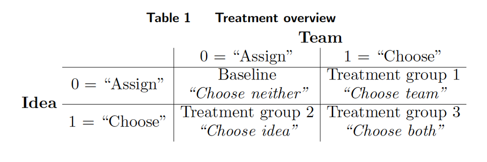
 

* "Assign" conditions: random (instead of managerial)
  * good benchmark

    (Clement & Puranam, 2018)<!-- .element: class="reference" --> 
  
  * especially for novel tasks where managers lack knowledge about people's specific skills

    (Puranam et al., 2014)<!-- .element: class="reference" --> 

  * approximates reality 

    (Liu et al., 2016)<!-- .element: class="reference" --> 

* "Raw" quality of 15 __pre-defined__ ideas does not differ from __self-chosen__ ideas
  * Robustness check on "Mechanical turk"

----

<!-- .slide: class="align-top" -->

## Experimental Treatments
<!-- .element: class="no-toc-progress" -->

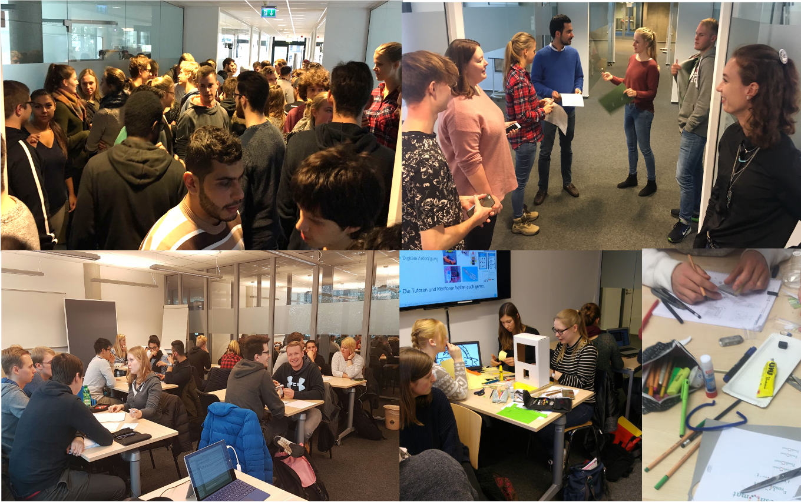
 

----

<!-- .slide: class="align-top" -->

## External Evaluation

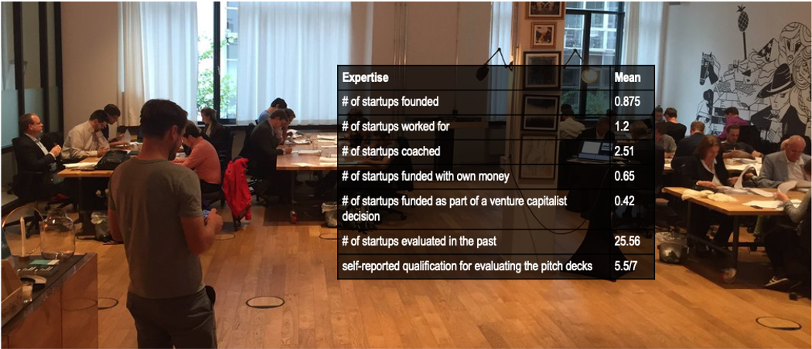
 

* 40 external evaluators, who were practicing entrepreneurs, business angels, or venture capitalists
  * each evaluated 23.25 pitch decks on average => 3 evaluation per team
  * Criteria:

    (Maxwell, 2011; Dean et al., 2006)<!-- .element: class="reference" --> 

    * Novelty, Feasibility, Market potential, Success potential, Invitation probability
    * Investment: Evaluators could distribute 1 million among the projects they evaluated

----

<!-- .slide: class="align-top" -->

## Analysis

* Linear regression accounting for non-independence of repeated and cross-nested observations with respect to mentors, experts, evaluation order, and cohorts:

 
 

`$ y_{ij} = \beta_{0} + \beta_{1}*(Choose\;team)_i + \beta_{2}*(Choose\;idea)_i + \beta_{3}*(Choose\;both)_i + \gamma_{i} + \delta_{i} + \zeta_{ij} + \eta_{j} + \epsilon_{ij} $`

----  ----

<!-- .slide: class="align-center" -->

# Results

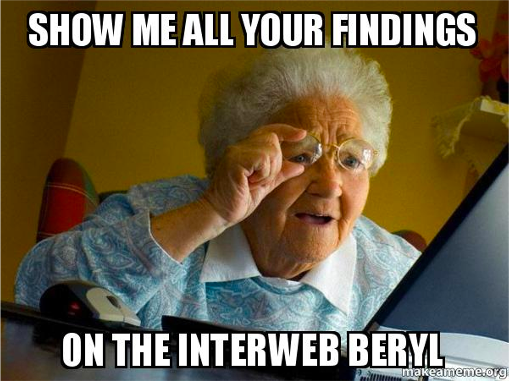

----

<!-- .slide: class="align-top" -->

## Main Results

 

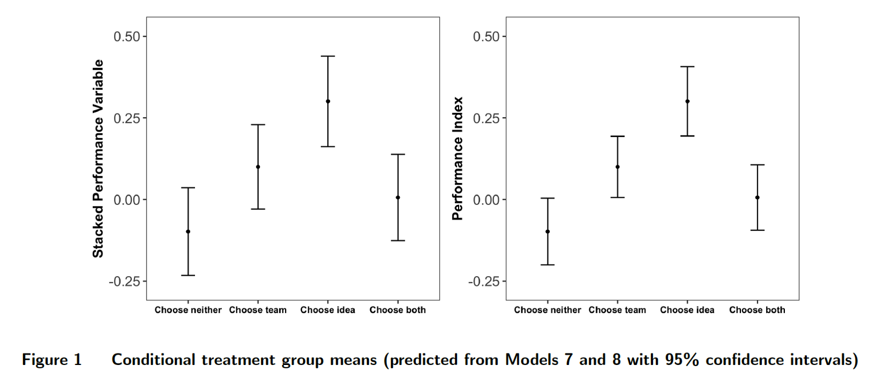

----

<!-- .slide: class="align-top" -->

## Main Results
<!-- .element: class="no-toc-progress" -->

 

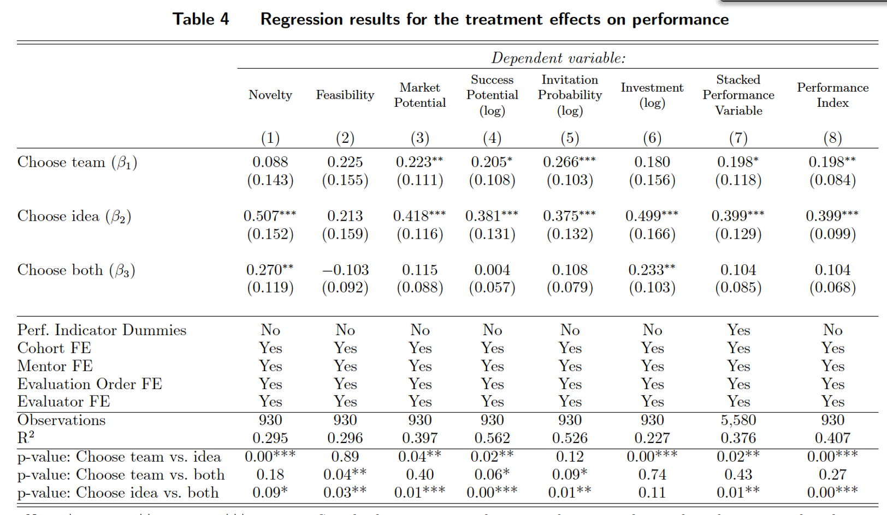

----

<!-- .slide: class="align-top" -->

## Kernel Densities and Quantile Regression

 

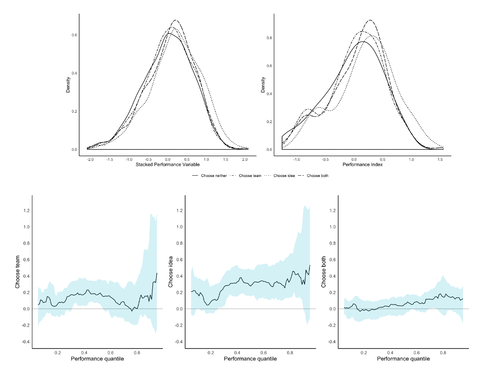

----

<!-- .slide: class="align-top" -->

## Channels of Mediation 

 

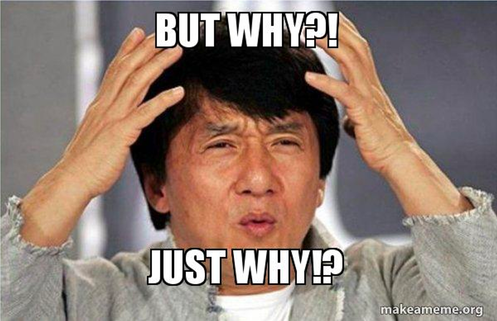

* Regression of intermediate outcomes on treatments:
  * Homophily
  * Prior ties
  * Team heterogeneity
  * Idea team fit
  * Collaboration quality

----

<!-- .slide: class="align-top" -->

## Causal Mediation Analysis

* Average Causal Mediation Effects (ACME)
  * control for pre-treatment variables to ensure sequential ignorability (conditional exogeneity of mediator)
  * quasi-Bayesian Monte Carlo method based on normal approximation with 1,000 simulations

    (Imai et al, 2010)<!-- .element: class="reference" --> 

 

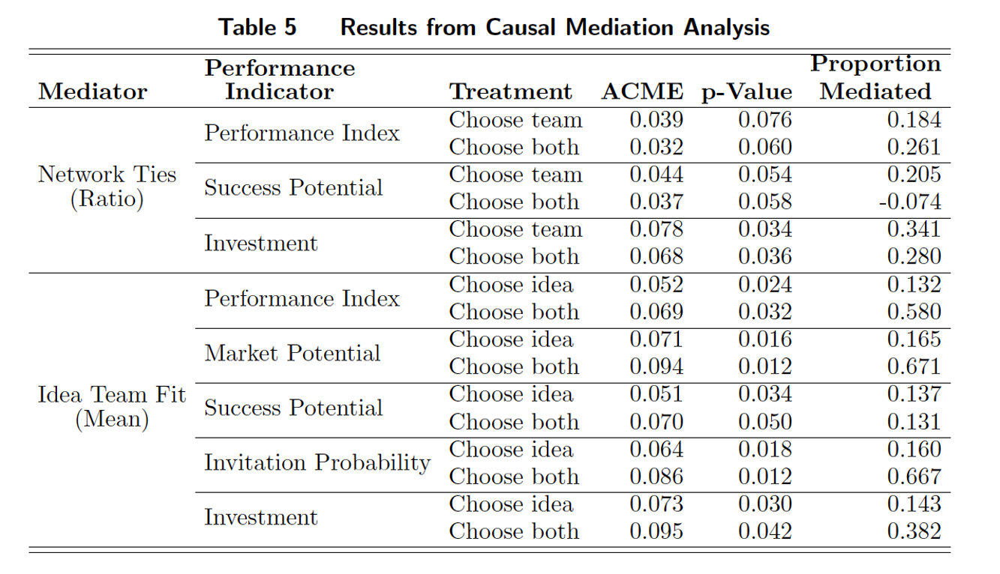

 

* Larger direct effects: changes in unobserved inputs induced by the treatments (e.g. motivation, effort)

  (Heckman & Pinto, 2015)<!-- .element: class="reference" --> 
   

----

<!-- .slide: class="align-top" -->

## Overconfidence as Mechanim

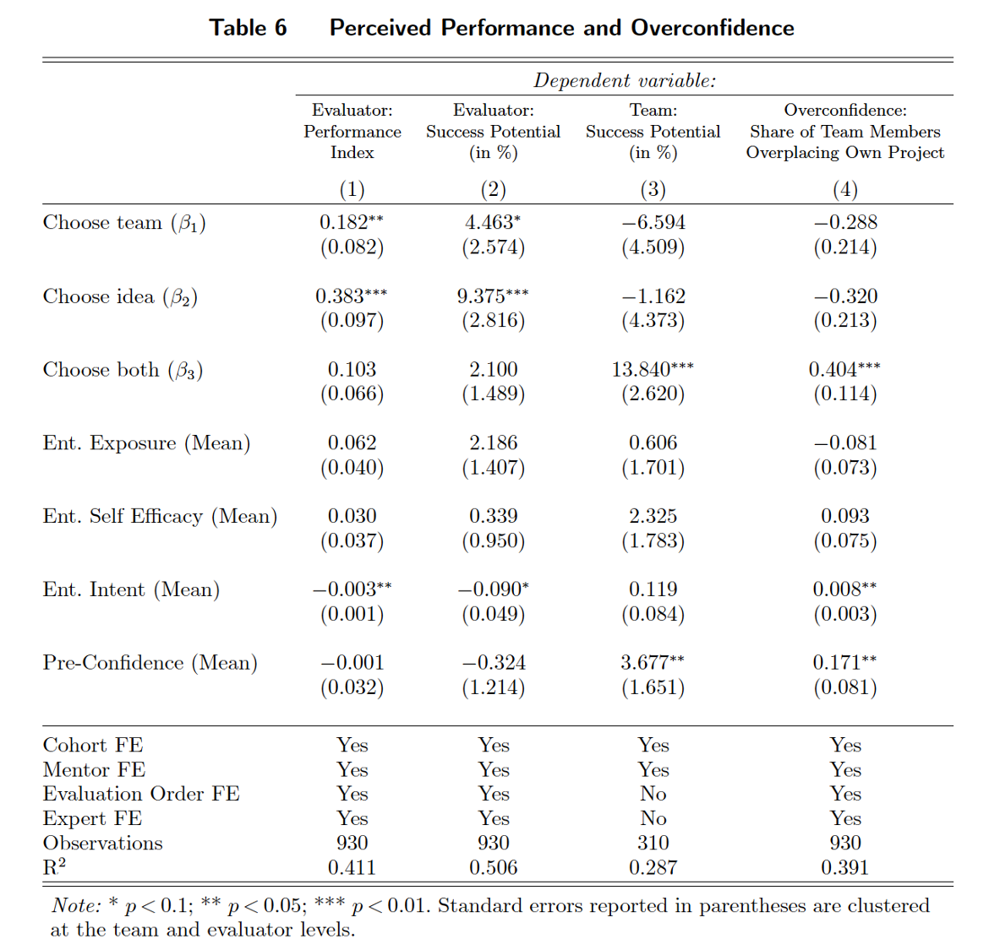

----  ----

<!-- .slide: class="align-center" -->

# Conclusion

----

<!-- .slide: class="align-top" -->

## Conclusion

#### Contributions

* __Theoretical__:

  * Organizational design and microfoundations of autonomy

  * Autonomy and entrepreneurial (over-) confidence

 

* __Practical__:

  * Professionalization of (corporate) entrepreneurship

  * Understand the design and limits of current practices

#### Limitations & outlook

* Field experiment with real organization
  * Managerial assignment
  * Realistic degrees of freedom in choice
    * More or less contraint depending on organizational context (goals, structure) 

 

* Mechanism studies in more controlled environments

----  ----

<!-- .slide: class="align-center" -->

<!-- .slide: data-state="no-toc-progress" --> <!-- don't show toc progress bar on this slide -->

# *Thank You for Your attention!*
<!-- .element: class="no-toc-progress" -->

## *Let's keep in touch!*

  <ul class=network-icon aria-hidden=true>
    <li>
         <a href=https://www.startupengineer.io/authors/ihl/>
              <i class="fas fa-home big-icon" class="accent">: https://www.startupengineer.io/authors/ihl</i>
         </a>
    </li>
    <li>
         <a href=mailto:christoph.ihl@tuhh.de>
              <i class="fas fa-envelope big-icon" class="accent">: christoph.ihl@tuhh.de</i>
         </a>
    </li>
    <li>
        <a href=https://twitter.com/Ihluminate target=_blank rel=noopener>
              <i class="fab fa-twitter big-icon"class="accent">: @IHLuminate</i>
        </a>
    </li>
    <li>
        <a href=https://www.linkedin.com/in/christoph-ihl/ target=_blank rel=noopener>
              <i class="fab fa-linkedin big-icon" class="accent">: https://www.linkedin.com/in/christoph-ihl</i>
        </a>
    </li>
  </ul>

 <!-- .element: class="logo" -->

